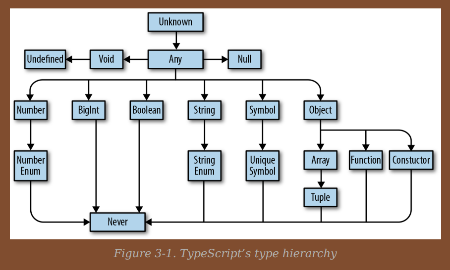

# All about types



## Types in the type hierarchy

## `any`

- `any` type - Can represent any value and allows any operations on the type. Equivalent to writing javascript code.

### `unknown`

- `unknown` - If you don't know the type ahead to time use this.
- But no operations is allowed on this type except for `===`, `==`, `!=`, `!==`, logical operators.
- Variables will have to be annotated as `unknown` **explicitly**. Compiler will never infer `unknown`.
- If we have to apply some operations on the variable, then we need to explicitly typecheck and typecast to perform the required operation.

### `boolean`

- `boolean` - `true` and `false`. Values like `NaN`, `null`, `undefined`, `""`, `0` evaluate to `false`.

```Typescript
let f = false // infer
let d: boolean = true // explicit boolean type

let e: true = true // using literal type to specific value.
```

> Type literal - A type that represents a single value and nothing else.

### `number`

- `number` - Integer, floats, infinity and NaN. Long number using underscore separation is allowed. Example `1_000_000` is 1 million.

```Typescript
// we can use underscore when defining literal types
let oneMillion: 1_000_000 = 1_000_000;
```

Literal types ensure the variable can take only that value.

```Typescript
let ab: 42 = 42;
let cd: number = 42;
console.log(ab === cd); //true
console.log(typeof ab === "number"); // true

// This is where literal types come into play
cd = 199; // works fine
// narrows the values that can be assigned to the variable
ab = 11; // raises error
```

### `bigint`

- `bigint` - Extremely large numbers

```Typescript
// bigint literals have to be suffixed with `n`
let a = 111n;
let b: bigint = 100n;

// using type literals
let c: 100n = 100n;
```

### `string`

- `string` - String data type.

### `symbol`

- `Symbol` - Every symbol is immutable and unique. A unique symbol is only equal to itself.

```Typescript
// explicit typing
const a: unique symbol= Symbol("a");

// ERROR: A variable that is of type unique symbol should be a const.
// So we cannot explicitly annotate as unique symbol on let/var
let g: unique symbol = Symbol('f');

// This is valid
let g = Symbol("g");

// type inference
const anotherA = Symbol("a");

// this prints false as every symbol is unique.
console.log(a == anotherA);
```

### `object`

- `object` - Arrays, functions, tuple, constructor are type `object`. `typeof null` also unfortunately yields `object`. With objects, javascript supports duck typing. **Adding or remving properties once the variable is declared results in type error.**

`{a: number}` is called as object literal notation.

```Typescript
// using explicit typing
let a: {b: number} = {
  b: 5
};
console.log(a.b);

// type inference
let a  = {
  b: 5
};
console.log(a.b);

let c: {
firstName: string
lastName: string
} = {
firstName: 'john',
lastName: 'barrowman'
};

class Person {
  constructor(
    public firstName: string,
    // public is shorthand for
    // this.firstName = firstName
    public lastName: string
  ) {}
}
c = new Person('matt', 'smith')
```

> By default, TypeScript is pretty strict about object properties—if you say the object should have a property called b that’s a number, TypeScript expects b and only b. If b is missing, or if there are extra properties, TypeScript will complain.

```Typescript
// object with optional property as well as scope for adding new properties
let a: {
  // readonly modifier
  readonly z: string;
  // required property
  b: number;
  // optional property
  c?: string;
} = {z: "abc", b: 1};
```

- [Index signatures](https://basarat.gitbook.io/typescript/type-system/index-signatures) - can be very useful to store different properties but all of same type.

```Typescript
// object with optional property as well as scope for adding new properties
let a: {
  // the below signature is called as index signature
  [key: number]: boolean;
} = {10: true, 20: false};
```

> Index signatures - There is one rule to keep in mind for index signatures: the index signature key’s type (T) must be assignable to either number or string. Syntax `[keyName: keyType(number | string)]: ValueType`.
> Object literal notation has one special case: empty object types `{}`. Every type—except `null` and `undefined` — is assignable to an empty object type, which can make it tricky to use. Try to avoid empty object types when possible
> Avoid typing something as `:Object`.

**NOTE**: If you pass any other object(except `number` type objects) to the index signature the JavaScript runtime actually calls `.toString` on it before getting the result. But When we code in typescript, we can only use `string` or `number` as the index type. If we have any other object, we should call toString on that object and use that value as the index.

```Javascript
// This is a JS snippet
let obj = {
  toString(){
    console.log('toString called')
    return 'Hello'
  }
}

let foo = {};
// IN JS toString called automatically
// IN TS below statement raises error.
// foo[obj.toString()] = 'World'; // works in Typescript
foo[obj] = 'World'; // toString called implicitly by JS
console.log(foo[obj]); // toString called, World
console.log(foo['Hello']); // World
```

- As soon as you have a `string` index signature, all explicit members must also conform to that index signature.

```Typescript
// This snippet is to demonstrate index signature with other properties
// Drawback with below snippet is even is you mistype `id` to `di`
// typecheck will succeed, but when we try it, it could be undefined.
type Student = {
  name: string;
  id?: string;
  [key: string]: string | undefined;
}

function printStudent(stud: Student): void {
  console.log(stud.id)
}

let stud: Student = {
  name: "John",
  di: "123",
}

printStudent(stud);
```

## Type aliases

We can declare variables that can hold a type as its value. This variable becomes the type alias.

```Typescript
type Age = number;

type Point = {
  x: number;
  y: number;
};
```

> Aliases are **never inferred** by TypeScript, so you have to type them explicitly.
> Wherever you see a type alias used, you can substitute in the type it aliases without changing the meaning of your program.

- A type cannot be declared twice and they have block scope.

## Union and intersection types

```Typescript
type Cat = {
  name: string;
  purrs: boolean;
};

type Dog = {
  name: string;
  barks: boolean;
  wags: boolean;
};

// Union
type CatOrDogOrBoth = Cat | Dog;

// intersection
type CatAndDog = Cat & Dog;
```

**NOTE**- When `unknown` is part of a union type, the result of the union will be `unknown`.

> An intersection type lets you combine multiple types into one. The structure of an object that has an intersection type has to **have the structure of all the types that form the intersection types**. It’s denoted by an & sign. All members of all the types are required in the object of an intersection type. - [Intersection type](https://levelup.gitconnected.com/typescript-advanced-types-union-and-intersection-types-9283046d7859)

- Intersection type can be used to extend type aliases.

```Typescript
type Pizza = {
  base: string;
}

// CheesyPizza should have both base and cheesy set to true
type CheesyPizza = Pizza & {
  cheesy: boolean;
}

let myPizza: CheesyPizza = {
  base: "wheat",
  cheesy: true
}
```

> Union types create a new type that lets us create objects that have some or all of the properties of each type that created the union type. Union types are created by joining multiple types with the pipe `|` symbol.
> If we have a union type, then we can only access members that are available in all the types that form the union type. - [Union types](https://levelup.gitconnected.com/typescript-advanced-types-union-and-intersection-types-9283046d7859)

An instance of the union type should have atleast all the properties from one of the types in the union. For example, with the `Cat | Dog`, the instance should have atleast all the properties from `Cat` or `Dog` or both. We cannot have partial properties from both the classes. Atleast one type in the union should have all its properties present in the instance.

```Typescript
// This is valid because it has all the properties of a Cat and
// additional properties from the union types.
let catOrDog: CatOrDogOrBoth = {
  name: "Cat",
  purrs: true,
  wags: true
}

// This is not valid because it does not contain all the properties
// from atleast one of the types in the union.
let catOrDogInvalid: CatOrDogOrBoth = {
  name: "Cat",
  wags: true
}
```

## Arrays

- In typescript we can express arrays as `T[]` or `Array<T>`.
- Arrays should be kept homogeneous.

```Typescript
// heterogenous array. not recommended due to the type guards
let d = [1, 'a'];

d.map(_ => {
  // this is a type guard.
  if (typeof _ === 'number') {
    return _ * 3;
  }

  return _.toUpperCase();
});
```

- For objects and arrays declared as const, typescript won't infer the types more narrowly.

- `let emptyArr = []` such definitions will cause the typescript compiler to infer the type as `any[]`

## Tuples

- Tuples are subtypes of array.
- Fixed length and known types.
- Have to be **explicitly typed always**.

```Typescript
let a: [number] = [1];

// pair
let kv: [string, number] = ["a", 1];

// tuples support optional elements
let optTuples: [number, number?] = [3.14];
optTuples = [1, 2];

// tuples can be used with rest elements as well
// rest elements can accept 0 or more elements
// useful in defining tuples with minimum lengths.
let restTuple: [string, ...string[]] = ["a", "b", "c"];
```

- Arrays are mutable by default. TypeScript comes with a readonly array type out of the box, which you can use to create immutable arrays.

- To create a `readonly` array, use an **explicit** type annotation; to update a read-only array, use nonmutating methods like `.concat` and `.slice`.

```Typescript
let arr1: readonly number[] = [1, 2, 3];
// use Readonly for <> notation
let arr2: Readonly<number[]> = [1, 2, 3];

//readonly tuple
let roTuple1: readonly [number, string] = [1, "a"];
let roTuple2: Readonly<[number, string]> = [1, "a"];
```

- Performant [immutable collections third party npm package](https://www.npmjs.com/package/immutable)

## null, undefined, void and never

> The only thing of type `undefined` is the value `undefined`, and the only thing of type `null` is the value `null`.

- `null` indicates absence of value while undefined represents something that is not yet defined.
- `void` is the return type of a function that doesn’t explicitly return anything.
- `never` is the type of a function that never returns at all. It can also be used as type of variable to indicate that all types are exhausted in the union types (switch case/if else default case).

```Typescript
function d(): never {
  throw TypeError('I always error')
}
```

## Enums

- By default enums assign numbers to the keys

```Typescript
// enums follow PascalCase naming convention
enum Language {
  English = 0,
  Spanish = 1,
  Tamil = "Tamil", // string values can also be assigned
};

// access key using square bracket or dot notation
console.log(Language.English);
console.log(Language["Spanish"]);
```

- We can split enum declarations across multiple places, but its recommended to explicitly specify the values.

- We can assign string values as well as mix string and numbers.

- We can get the enum using its numerical value in the square brackets. But to raise error when a value that's not assigned to any member, we need to declare the enum as `const`.

```Typescript
const enum Language {
  English,
  Tamil,
  Russian
};
// This should not compiler. To ensure error is raised,
// we need to make the enum Language const
console.log(Language[3]); // This will raise error
```

**NOTE**: Constant enums can only be accessed via string keys(string literals).

```Typescript
const enum Language {
  English = "Eng",
  Tamil = "Tam",
  Russian = "Rus"
};

// We can only access using the key in both dot notation as well as
// square brackets
console.log(Language["Tamil"]);
console.log(Language.English);

//unlike numerical enums we cannot use values in the square brackets
console.log(Language["Rus"]); // Error
```

**NOTE**: Typescript inlines the enum member’s value wherever it’s
used. To avoid this set the `preserveConstEnums` compiler option to true.

**TIP**- **Use string valued enums for strict type checking**, because enums with number values can accept any number as its value when passing to function parameters.

### Enum Recommendations

- Stay away from enum due to its type issues.
- Avoid numeric valued enums and non const enums.
